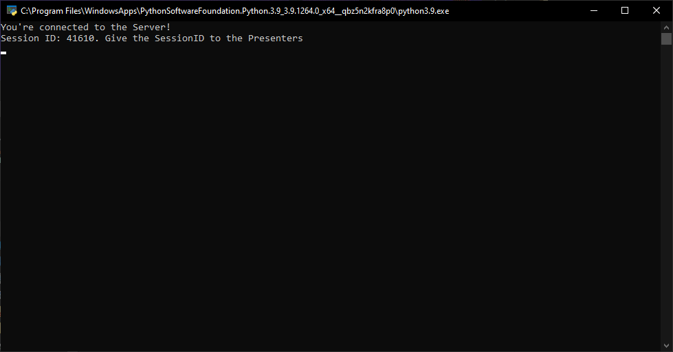
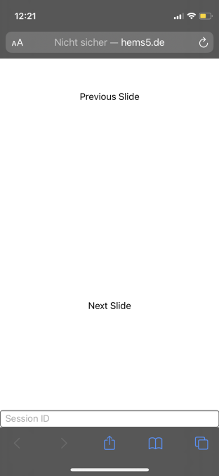

<h1 align="center">
  PowerPoint Clicker
</h1>

# Requirements
* Python 3 (Recommended: Python 3.9)
* PIP

# Usage
## For the Presenter
* Go to https://hems5.de/Clicker
* Type in the 5 Digit Session ID and press Enter
* Click Next / Previous Slide

## For the Streamer
* Download and run the Python Script in /Client/
* Give your Presenters the Session ID
* Click into Powerpoint.

# Installation (For Streamer)
* Download the Script.py File from /Client/
* Install the Requirements using `pip install -r requirements.txt `

# How it works
This Project was written in 30 Minutes. Don't expect anything fancy. When the Presentor clicks on one of the Buttons it will send a Request to the Python Script running on the Streamers PC to press the Arrows Left or Arrow Right button. For this to work you'll need to be active in the Presentation.

# Setup Video

# Screenshots

<h1 align="center">
  
</h1>

<h1 align="center">
  
</h1>