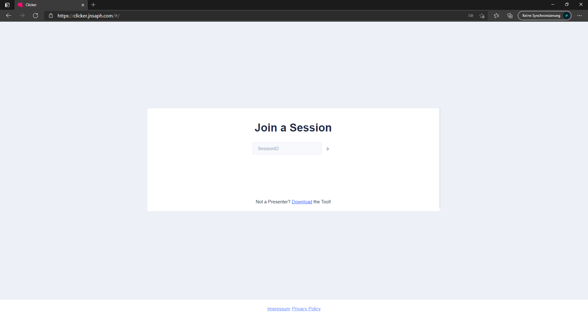
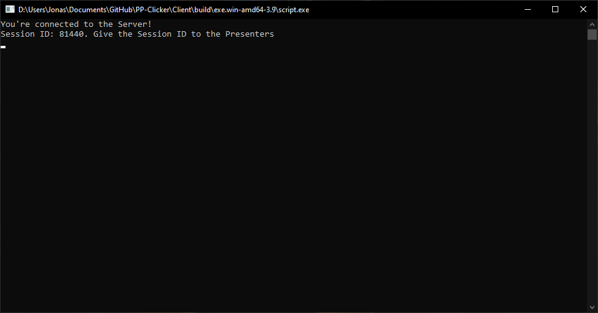

      
  <h1 align="center">
    CLICKR
  </h1>

<h3 align="center">
  Present presentations the way they were created.
</h3>

CLICKR enables you to present presentations with your group even more easily. Download the client, share the code and boom! You're up and runing.

# 📥 Download
Go to the [Releases tab](https://github.com/JNSAPH/Clickr/releases) and download the latest version.

## Usage
### **Presenter**
* Go to https://clicker.jnsaph.com
* Enter the 5-digit session ID and click Next
* Click Next / Previous Slide to control the presentation

### **Streamer**
* Download and run the client.
* Give the session ID to the presenters
* Make sure your preferred presentation program is always highlighted and can be controlled with the arrow keys

# 🖼️ Screenshots & Videos
## Installation Video

## Images

# ⚙️ Developing / Building yourself
## Requirements
* Python 3 (Recommended: Python 3.9)
* PIP

## How it works
After the presentator has pressed one of the two buttons on his device, a webhook request is sent to the client with the session ID via our server. Depending on whether the presentation is to be moved forwards or backwards, the client emulates the push of the corresponding arrow key. 

## Comming Soon™

# ❤️ Special thanks
* [Jojo599k](https://github.com/jojo599k/)
